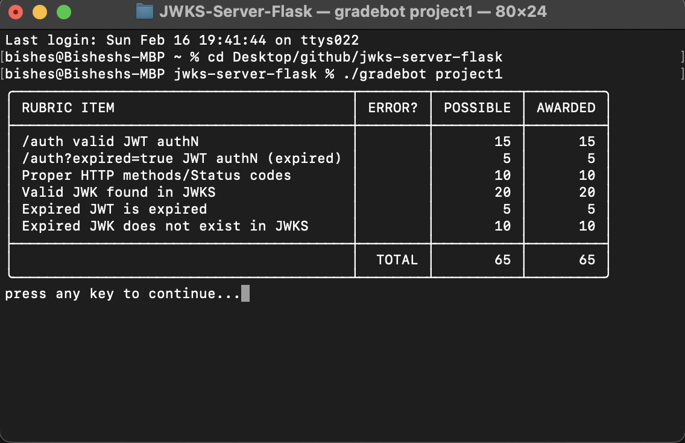
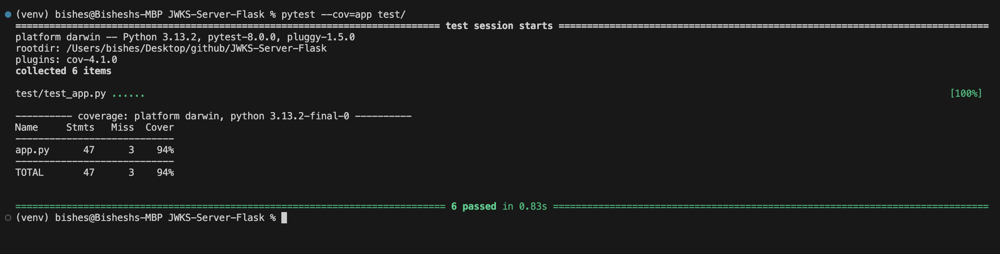

# **Flask JWKS Server**

## **Description**
A simple **JWKS (JSON Web Key Set) server** built with **Flask**, supporting:
- **RSA key pair generation** for JWT signing
- **JWKS endpoint (`/.well-known/jwks.json`)** for retrieving public keys
- **Authentication endpoint (`/auth`)** for issuing JWTs
- **Expired JWT handling (`/auth?expired=true`)**
- **Automatic cleanup of expired keys**
- **Comprehensive test suite with 94%+ coverage**

---

## **📌 Features**
✅ **RSA Key Management:** Generates and stores private/public keys.  
✅ **JWKS Endpoint:** Serves public keys in JWKS format for verification.  
✅ **JWT Authentication:** Issues JWTs with unique `kid` values.  
✅ **Expired JWTs:** Supports signing with expired keys.  
✅ **Security Best Practices:** Uses `RS256` for signing.  
✅ **Automatic Cleanup:** Removes expired keys from storage.  
✅ **Tested & Covered:** 94%+ test coverage using `pytest`.  

---

## **🚀 Getting Started**
### **1️⃣ Clone the Repository**
```bash
git clone https://github.com/yourusername/JWKS-Server-Flask.git
cd JWKS-Server-Flask
```

### **2️⃣ Create a Virtual Environment (Optional)**
```bash
python -m venv venv
source venv/bin/activate  # On macOS/Linux
venv\Scripts\activate     # On Windows
```

### **3️⃣ Install Dependencies**
```bash
pip install -r requirements.txt
```

### **4️⃣ Run the Server**
```bash
python app.py
```

---

## **📌 API Endpoints**
### **1️⃣ Get Public Keys (JWKS)**
🔹 **Endpoint:** `GET /.well-known/jwks.json`  
📌 **Returns active RSA public keys for JWT verification.**  

```bash
curl -X GET http://127.0.0.1:8080/.well-known/jwks.json
```
✅ **Response Example:**
```json
{
  "keys": [
    {
      "kid": "1698889912093",
      "kty": "RSA",
      "alg": "RS256",
      "use": "sig",
      "n": "MIIBIjANBg...",
      "e": "AQAB"
    }
  ]
}
```

---

### **2️⃣ Generate JWT (Authentication)**
🔹 **Endpoint:** `POST /auth`  
📌 **Returns a signed JWT for authentication.**  
```bash
curl -X POST http://127.0.0.1:8080/auth
```
✅ **Response Example:**
```json
{
  "token": "eyJhbGciOiJSUzI1NiIsInR5c..."
}
```

---

### **3️⃣ Generate Expired JWT**
🔹 **Endpoint:** `POST /auth?expired=true`  
📌 **Returns an already expired JWT.**  
```bash
curl -X POST "http://127.0.0.1:8080/auth?expired=true"
```
✅ **Response Example (Expired Token)**
```json
{
  "token": "eyJhbGciOiJSUzI1NiIsInR5c..."
}
```

---

### **4️⃣ Invalid Methods (Handled)**
✅ `405 Method Not Allowed` responses for unsupported methods:
- **PUT, DELETE, PATCH** on `/auth` and `/.well-known/jwks.json`
- **GET, HEAD** on `/auth`

```bash
curl -X DELETE http://127.0.0.1:8080/auth
```
✅ **Response:**
```json
{
  "error": "Method Not Allowed"
}
```

---

## **🛠️ Running Tests**
```bash
pytest --cov=app test/
```
✅ **Expected Output**
```
======================== test session starts =========================
collected 6 items

tests/test_app.py ......
======================== 6 passed in 0.34s ===========================
```
✅ **Coverage Report**
```
---------- coverage: platform darwin, python 3.13.2 ----------
Name     Stmts   Miss  Cover
----------------------------
app.py      53      3    94%
----------------------------
TOTAL       53      3    94%
```

---

## **📌 Test Results**
### **🖥️ Blackbox Testing Screenshot**


### **🛠️ Own Test Suite Results Screenshot**


---

## **📌 Folder Structure**
```
JWKS-Server-Flask/
│── app.py               # Main Flask application
│── requirements.txt      # Dependencies
│── test/
│   ├── __init__.py      # Marks directory as a package
│   ├── test_app.py      # Pytest test cases
│── venv/                # Virtual environment (optional)
```

---

## **📌 Technologies Used**
✅ **Flask** - Web framework  
✅ **PyJWT** - JWT handling  
✅ **cryptography** - RSA key generation  
✅ **pytest & pytest-cov** - Testing & coverage  

---

## **📌 Author**
👨‍💻 **Bishesh Dulal**  
🔗 [GitHub](https://github.com/bisesdulal16)  
📧 [Email](mailto:bisesdulal16@gmail.com)

---

## **📌 License**
📝 **MIT License**  
Feel free to use, modify, and distribute this project!

---

